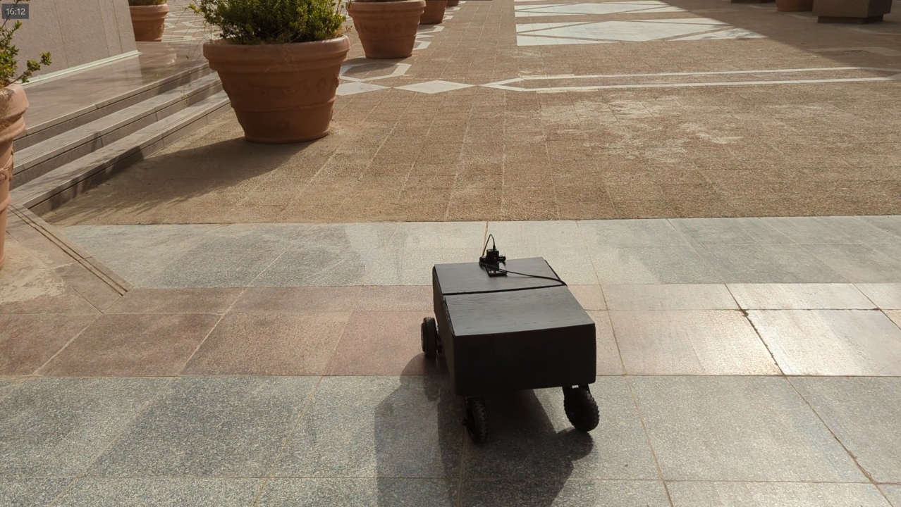
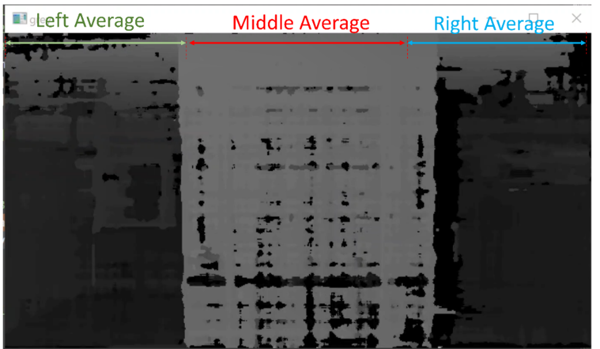
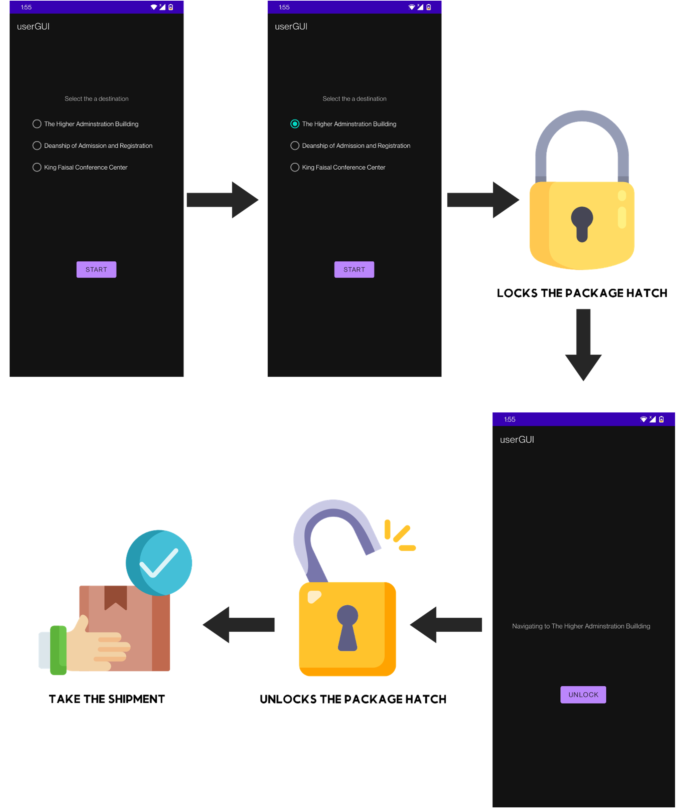

# On-Campus Delivery Robot
_____  

This project was developed as a senior design project by Electrical and Computer Engineering students at KAU, Jeddah, KSA in Fall 2021.  

## Introduction
_____  

This project is an on-campus delivery robot that is designed to ship packages of different sizes and weights between set stations within the KAU campus. It is an autonomous robot that uses sensor data from an android phone and a hoverboard for localization. Using the GPS coordinates of the waypoint it can travel to to it's destination while avoiding obstacles. An app was also developed for users to select the destination of the package.

## Sensor Fusion
_____  
Localization is done using sensors from an android phone including an IMU (accelerometer, gyroscope, magnetometer), and a GPS sensor. Aditionally odometry data from the hoverboard itself is also used. The android app fuses the GPS signal and the odomoetry for accurate robot position estimation. And fuses GPS yaw with the IMU yaw for orientation.  

## Navigation
_____  
For navigation, The robot is given commands for linear velocity and angular velocity. A PD controller is implmented for angular velocity, which takes into account the current position and the last position for smoother turning. For linear velocity a function based on the natural exponential function is used such that the speed is faster if the robot is facing the waypoint and slower when turning.

## Obstacle Avoidance
_____  
Obstacle avoidance was implemented using an Oak-D camera for depth estimation. By using the depth map from the Oak-D and segmenting the frame into three sections and calculating the average intensity of each section, we were able to detect where the obstacle is by comparing each average intesntiy to a threshhold. If an obstacle is detected, the robot turns away from obstacles with a speed propotional to the average intensity of the sections where the obstacle is. In other words, it turns away faster obstacles that are close. 

## Instructions
These operational instructions summarize the steps for using the product:
<ol>
  <li>	Place the shipment inside the package hatch.</li>
  <li>	Select the destination and press START.</li>
  <li>	The robot is now locked..</li>
  <li>	The robot will start navigating toward the selected destination.</li>
  <li>	When the robot arrives, it will be waiting for the user to unlock the hatch and take the shipment.</li>
</ol>

The figure below shows The steps for delivering a package using the mobile application.
</ol>

## Code
____  
- HoverboardLink_ESP8266.ino:
  - This is deployed to the ESP8266 which is connected to the Tx, Rx pins in the hoverboard's control board, to be able to get odometry data and send commands to the hoverboard
  - This firmware hack is required to be able to control the hoverboard. https://github.com/EFeru/hoverboard-firmware-hack-FOC 
- HoverboardGNCApp.slx.
  - This builds the phone app that takes the android sensors and fuses them with GPS/odometry.
  - Build using Simulink then use android studio to disable taking GPS readings from network and reduce the minimum distance for readings to 0 meters.
- UserGui.zip
  - This contains the gradle file for the user app which is used to select the destination.
  - Deploy using android studio. Version used: android-studio-2020.3.1.26
- HoverboardGNC.py
  - Main code containing obstacle avoidance and navigation algorithms. Also allows manual control using arrow keys. 

## The Team
Muhannad Saeed Alghamdi	: Mhdghd2@gmail.com

Sulaiman Abdullah Abbas: Sulaiman_samonah@Hotmail.com 

Wael Rabah Aldhaheri: WaAldhaheri@gmail.com

## Acknowledgement
The project was finished with technical and logistics help from Robotics Lab at Center Of Excellence in Intelligent Engineering Systems, KAU.    

